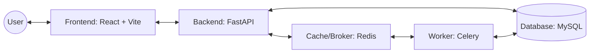

# HGO Discovery: Smart BI-Based DSS

**HGO Discovery** adalah Sistem Pendukung Keputusan (SPK) cerdas berbasis Business Intelligence yang dirancang untuk menentukan prioritas pelayanan pasien. Aplikasi ini mengimplementasikan algoritma **HGO (Hierarchy, Governance, Outlook)** yang terinspirasi dari pola persistensi dan efisiensi *Honey Badger Optimization*.


---

## Arsitektur Sistem

Sistem ini menggunakan arsitektur modern yang memisahkan antara *Core Engine* (Backend), *Interactive Dashboard* (Frontend), dan *Background Processing* (Worker).



### Tech Stack Utama:
| Layer | Teknologi | Peran |
| :--- | :--- | :--- |
| **Frontend** | React 18, Zustand, TailwindCSS, Recharts | Antarmuka dashboard interaktif & state management. |
| **Backend** | FastAPI, SQLAlchemy 2.0 (Async), Alembic | RESTful API dengan performa tinggi & asinkron. |
| **Database** | MySQL 8.0 | Penyimpanan data pasien, kriteria, dan hasil ranking. |
| **Worker** | Celery + Redis | Pemrosesan tugas berat (Import Excel & Kalkulasi Masif). |
| **DevOps** | Docker & Docker Compose | Kontainerisasi untuk kemudahan deployment lokal. |

---

## Inti Algoritma (Agentic Core)

Aplikasi ini tidak hanya sekadar kalkulator, tetapi menggunakan pendekatan **Agentic** yang mendefinisikan peran-peran cerdas dalam pipeline HGO:

1.  **Hierarchy Agent (H):** Melakukan pemetaan data kualitatif menjadi nilai *crisp*.
2.  **Governance Agent (G):** Melakukan normalisasi data (Min-Max) berdasarkan tipe kriteria.
3.  **Outlook Agent (O):** Menghitung **HGOd Index** dan menentukan ranking final.

> [!NOTE]
> Detail teknis mengenai agen ini dapat dilihat pada file [agents.md](file:///d:/Project/Aplikasi%20SPK/hgo-app/agents.md).

---

## Memulai (Deployment Lokal)

### Opsi 1: Menggunakan Docker (Sangat Direkomendasikan)
Cara tercepat untuk menjalankan seluruh ekosistem (API, DB, Redis, Worker, UI) tanpa instalasi manual.

1.  **Clone Repositori:**
    ```bash
    git clone https://github.com/dmasprstya/hgo-app.git
    cd hgo-app
    ```

2.  **Setup Environment:**
    ```powershell
    cp .env.example .env
    cp backend/.env.example backend/.env
    cp frontend/.env.example frontend/.env
    ```

3.  **Build & Run:**
    ```bash
    docker-compose up --build
    ```

4.  **Akses Aplikasi:**
    *   **Frontend:** [http://localhost:5173](http://localhost:5173)
    *   **Backend API:** [http://localhost:8000](http://localhost:8000)
    *   **API Docs:** [http://localhost:8000/docs](http://localhost:8000/docs)

---

### Opsi 2: Instalasi Manual
Gunakan opsi ini jika Anda ingin melakukan pengembangan aktif pada salah satu servis.

#### 1. Setup Database
Buat database bernama `spk_hgo` di MySQL lokal Anda.

#### 2. Setup Backend
```bash
cd backend
python -m venv .venv
source .venv/bin/activate  # atau .venv\Scripts\activate di Windows
pip install -r requirements.txt
alembic upgrade head
uvicorn app.main:app --reload
```

#### 3. Setup Frontend
```bash
cd frontend
npm install
npm run dev
```

#### 4. Setup Worker (Opsional)
```bash
cd backend
celery -A app.core.celery_app worker --loglevel=info -P solo
```

---

## Kredensial Default

Setelah migrasi selesai, Anda dapat masuk menggunakan akun administrator default:

| Akun | Kredensial |
| :--- | :--- |
| **Email** | `admin@spk-hgo.local` |
| **Password** | `Admin@123` |
| **Role** | `superuser` |

---

## Struktur Folder

```text
hgo-app/
├── backend/            # FastAPI + Python Logic
│   ├── app/            # Core application code
│   ├── alembic/        # Database migrations
│   └── Dockerfile      # Backend container config
├── frontend/           # React + Vite Dashboard
│   ├── src/            # UI components & logic
│   └── Dockerfile      # Frontend container config
├── agents.md           # Dokumentasi logika agen H-G-O
├── docker-compose.yml  # Orchestration semua servis
└── README.md           # Dokumentasi utama
```

---

##  Konfigurasi Kriteria

Secara default, aplikasi menggunakan 6 kriteria utama sesuai studi kasus:

| Kode | Nama Kriteria | Tipe | Bobot |
| :--- | :--- | :--- | :--- |
| **Cr1** | Insurance | Benefit (+) | 10% |
| **Cr2** | Surgery | Cost (-) | 20% |
| **Cr3** | Room Class | Benefit (+) | 7.5% |
| **Cr4** | Admission Type | Benefit (+) | 12.5% |
| **Cr5** | Severity Score | Benefit (+) | 20% |
| **Cr6** | Test Result | Benefit (+) | 15% |

---

## Lisensi

Proyek ini dilisensikan di bawah **MIT License**. Silakan gunakan untuk keperluan riset dan akademik.

---
*Dibuat oleh [Dimas Prasetya](https://github.com/dmasprstya)*

