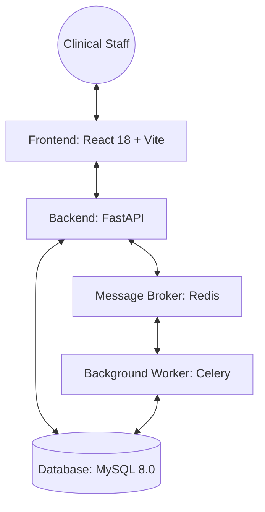

# HGO Discovery: Smart BI-Based DSS
> **A High-Performance Decision Support System for Patient Prioritization**

**HGO Discovery** is an intelligent Decision Support System (DSS) designed to optimize patient priority ranking using the **HGO (Hierarchy, Governance, Outlook)** algorithm. Inspired by the efficiency and persistence of *Honey Badger Optimization*, this system processes multi-criteria decision-making (MCDM) at scale, ensuring clinical resources are allocated to those who need them most.


---

## Key Features

-  **Automated Prioritization**: Implements the HGO algorithm to rank patients across four priority levels: *Critical, High, Medium,* and *Low*.
-  **Advanced Visual Analytics**: 
  - **Scatter Charts**: Visualize patient distribution across HGOd Index and Output Scores.
  - **Dumbbell Charts**: Analyze the "Gap" between raw values and normalized priority scores.
-  **Asynchronous Processing**: Background tasks powered by **Celery & Redis** for handling massive patient imports (up to 55,000+ entries) without UI lag.
-  **Role-Based Access**: Secure authentication system with dedicated Admin and Analytical roles.
-  **Smart Data Import**: Multi-format support for Excel and CSV with automated data validation and crisp value mapping.
-  **Medical Design System**: A "Sterile" professional UI/UX using Tailwind CSS, optimized for high readability in clinical environments.

---

## System Architecture

The application follows a decoupled monorepo structure, ensuring scalability and ease of maintenance.



### Technology Stack

| Layer | Technologies | Description |
| :--- | :--- | :--- |
| **Frontend** | React 18, Zustand, Tailwind CSS, Recharts | Interactive dashboard with real-time state management. |
| **Icons** |  Heroicons | Professional SVG icon set for clinical clarity. |
| **Backend** |  FastAPI, SQLAlchemy 2.0, Alembic | High-performance, asynchronous REST API. |
| **Database** | MySQL 8.0 | Relational storage for patients, criteria, and simulation logs. |
| **Processing**| Celery + Redis | Distributed task queue for heavy computation. |
| **DevOps** | Docker, Docker Compose | Containerized orchestration for easy deployment. |

---

## Agentic Core (H-G-O Pipeline)

This system utilizes an **Agentic Approach** to manage the decision-making pipeline. Each stage is handled by a specialized logical "Agent":

1.  **Hierarchy Agent (H)** : Maps qualitative patient data (e.g., "Emergency", "BPJS") into quantifiable *Crisp Values*.
2.  **Governance Agent (G)** : Standardizes the decision matrix using Min-Max normalization for both Benefit and Cost criteria.
3.  **Outlook Agent (O)** : Calculates the final **HGOd Index** and applies weighted priority ranking.

> [!TIP]
> For a deep dive into the mathematical formulas and agent personas, refer to the [AGENTS.md](agents.md) documentation.

---

## Getting Started

### Option 1: Docker (Recommended)
The fastest way to launch the full ecosystem (API, DB, Redis, Worker, UI).

1.  **Setup Environment**:
    ```bash
    cp .env.example .env
    cp backend/.env.example backend/.env
    cp frontend/.env.example frontend/.env
    ```
2.  **Build & Run**:
    ```bash
    docker-compose up --build
    ```
3.  **Access**:
    - Dashboard: [http://localhost:5173](http://localhost:5173)
    - API Documentation: [http://localhost:8000/docs](http://localhost:8000/docs)

### Option 2: Manual Installation
1.  **Database**: Create a MySQL database named `spk_hgo`.
2.  **Backend**:
    ```bash
    cd backend
    python -m venv .venv
    # Activate venv: .venv\Scripts\activate (Win) or source .venv/bin/activate (Unix)
    pip install -r requirements.txt
    alembic upgrade head
    uvicorn app.main:app --reload
    ```
3.  **Frontend**:
    ```bash
    cd frontend
    npm install
    npm run dev
    ```
4.  **Worker**:
    ```bash
    cd backend
    celery -A app.core.celery_app worker --loglevel=info -P solo
    ```

---

## Default Credentials

| Role | Email | Password |
| :--- | :--- | :--- |
| **Administrator** | `admin@spk-hgo.local` | `Admin@123` |

---

## Decision Criteria

The HGO algorithm currently utilizes 6 clinical criteria as defined in the core research:

| Code | Criterion | Type | Weight |
| :--- | :--- | :--- | :--- |
| **Cr1** | Insurance Provider | Benefit (+) | 10% |
| **Cr2** | Surgery Requirement | Cost (-) | 20% |
| **Cr3** | Room Class | Benefit (+) | 7.5% |
| **Cr4** | Admission Type | Benefit (+) | 12.5% |
| **Cr5** | Severity Score | Benefit (+) | 20% |
| **Cr6** | Clinical Test Result | Benefit (+) | 15% |

---

## 📄 License
This project is licensed under the **MIT License**.

---
*Developed by [Dimas Prasetya](https://github.com/dmasprstya)*
