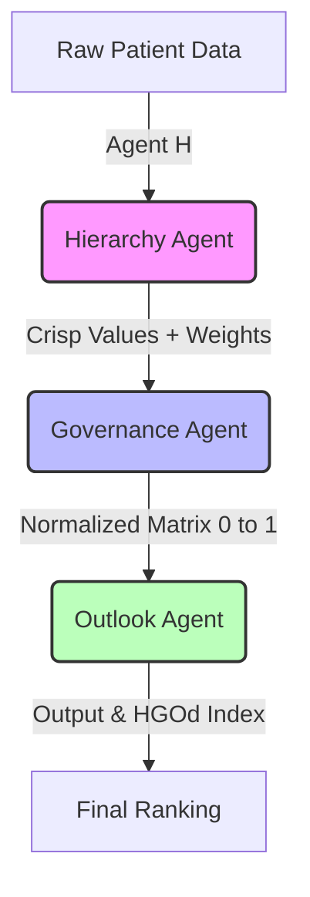

# Agents Documentation — HGO Discovery (Smart BI-Based DSS)

Welcome to the agentic core of **HGO Discovery**. This document defines the various "Agents" that power the Decision Support System, ranging from computational search entities to operational system roles, based on the HGO Discovery algorithm as defined in the original study.

---

## 1. Optimization Agents (The Honey Badger Analogy)

> *Note: In the original paper, "HGO" stands for **Hierarchy, Governance, Outlook**, not Honey Badger Optimization. However, for the purpose of agent-based documentation, we map the algorithm's persistence and dual-phase processing to Honey Badger characteristics.*

Each agent represents a **Honey Badger** exploring the multi-criteria decision space. Their "prey" is the optimal patient priority ranking (lowest HGOd Index).

### Agent Persona
- **Persistence:** The algorithm processes up to 55,000 data entries without losing accuracy.
- **Dual-mode strategy:** Mimics the two main stages of HGO Discovery (Normalization & Ranking).

### Behavioral Modes (Mapped to HGO Stages)

| Mode | HGO Stage | Mathematical Operation | Application in SPK |
| :--- | :--- | :--- | :--- |
| **Digging Mode** (Exploration) | Hierarchy + Governance | Normalization matrix construction:   `HGOd(j) = MinXhgij / Xhgij` (for negative criteria)   `HGOd(j) = Xhgij / MaxXhgij` (for positive criteria) | Transforms raw criteria values into a standardized scale [0,1]. |
| **Honey Mode** (Exploitation) | Outlook (Ranking) | Weighted sum & HGOd Index:   `Output = Σ(Wj × Tij)`   `HGOd Index = 1 / Σ(Wj × Xj)` | Ranks patients where **lower HGOd Index = higher priority**. |

### Agent Attributes (Patient-Level)

| Attribute | Symbol | Source | Description |
| :--- | :--- | :--- | :--- |
| **Position (X)** | `Xhgij` | Table V | Raw value of patient i for criterion j |
| **Normalized Value** | `Tij` | Table VI | Value after normalization [0,1] |
| **Output Score** | `Output` | Table VII | Weighted sum = Σ(Wj × Tij) |
| **Fitness (Prey)** | `HGOd Index` | Table VIII | `1 / Σ(Wj × Xj)` — Lower is better |

---

## 2. Process Agents (The H-G-O Pipeline)

These agents correspond directly to the three dimensional approaches defined in the paper: **Hierarchy, Governance, and Outlook**.

### 🔹 Agent H: Hierarchy (Mapping)
*   **Role:** Converts raw patient data (e.g., "BPJS", "Gawat Darurat") into initial crisp values.
*   **Intelligence:** Uses a pre-defined mapping table (similar to Table V in the study) to quantify qualitative inputs.

### 🔹 Agent G: Governance (Normalization)
*   **Role:** Standardizes the crisp values into a consistent matrix `T` where all values are between 0 and 1.
*   **Intelligence:** Applies different normalization formulas for **Positive Criteria** (e.g., Age) and **Negative Criteria** (e.g., Distance) to ensure mathematical consistency.
    *   **Formula (Negative):** `Tij = MinXhgij / Xhgij`
    *   **Formula (Positive):** `Tij = Xhgij / MaxXhgij`

> **Catatan Formula:** Untuk kriteria negatif (semakin kecil semakin baik, seperti jarak), pembagi adalah nilai `Xhgij` sendiri agar hasil normalisasi tetap dalam rentang [0,1]. Nilai minimum di pembilang memastikan pasien dengan nilai terkecil mendapat skor tertinggi (= 1).

### 🔹 Agent O: Outlook (Ranking)
*   **Role:** Calculates the final weighted sum and the **HGOd Index** to determine priority.
*   **Intelligence:** Applies the weights derived from the Hierarchy stage to the normalized matrix.
    *   **Formula:** `HGOd Index = 1 / Σ(Wj × Xj)`
    *   **Result:** A lower HGOd Index indicates a higher priority for the patient.

---

## 3. Operational Agents (System Roles)

The human and system entities that interact with the HGO engine.

### Admin Agent
*   **Capabilities:** Manages user authentication, imports patient datasets (via Excel/CSV), and triggers HGO simulations.
*   **Access:** Full CRUD on patients, criteria weights, and system settings.

### Analytical Agent (The Decision Maker)
*   **Capabilities:** Consumes the dashboard stats and HGO rankings to make actual clinical decisions.
*   **Focus:** Monitoring "Critical" and "High" priority quartiles and reallocating resources.

### AI Operational Agent (Antigravity)
*   **Capabilities:** Repository maintenance, algorithm optimization, and documentation synchronization.
*   **Status:** **Active** (Currently managing this documentation).